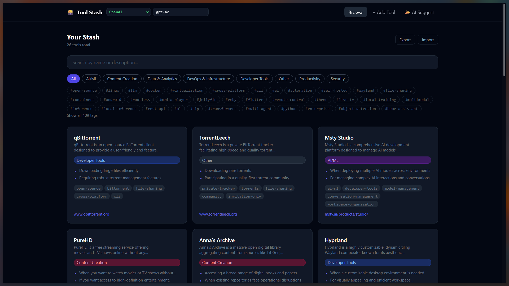
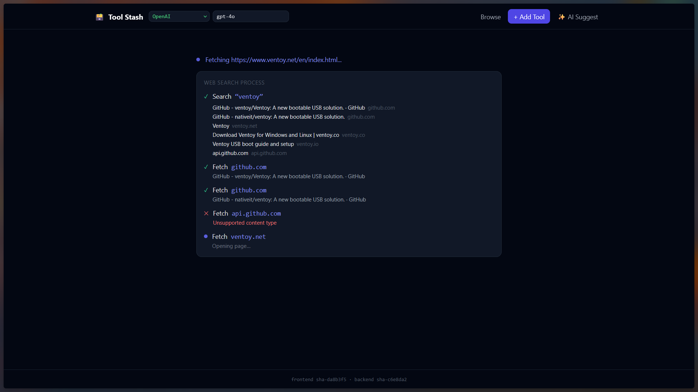
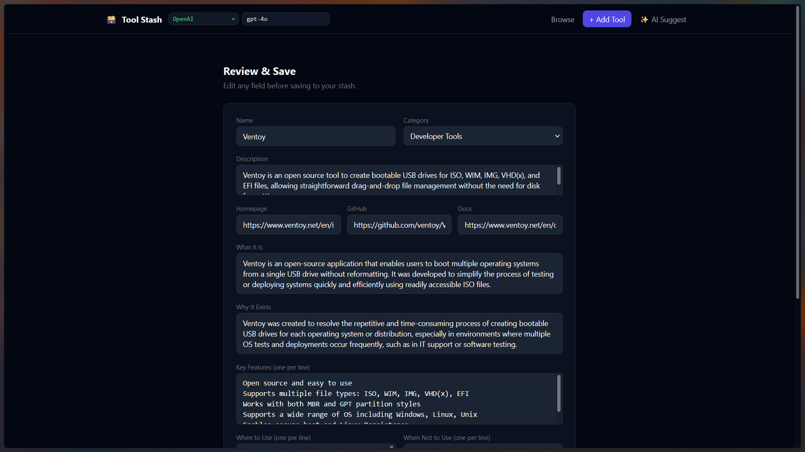
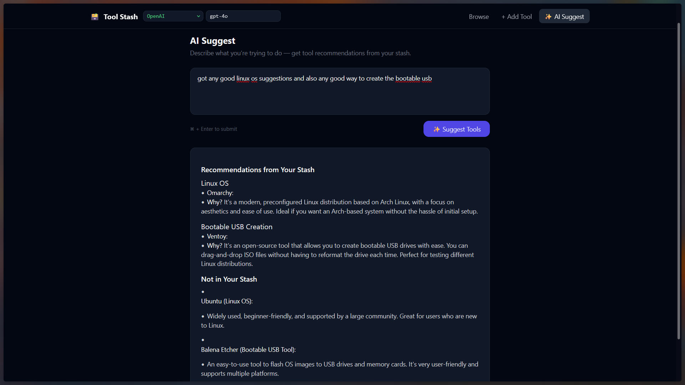

# Tool Stash

Personal catalog of tools you run into, with an AI agent that researches a name or URL and fills in the profile.

Images: 
- [nerdygamer611/tool-stash-backend](https://hub.docker.com/r/nerdygamer611/tool-stash-backend)
- [nerdygamer611/tool-stash-frontend](https://hub.docker.com/r/nerdygamer611/tool-stash-frontend)

## Screenshots

**Browse** — search, categories, and tags.



**Research** — live web search while the agent fills a profile.



**Review & Save** — edit the researched profile before it hits your stash.



**AI Suggest** — describe a task and get recommendations from your stash.



## Run from Docker Hub (bundled Ollama)

Self-contained stack: frontend, backend, and Ollama with `qwen2.5:3b` pulled and selected by default (~2 GB). Research hits the public web via DuckDuckGo (no API key).

Save this as `docker-compose.yml`:

```yaml
services:
  ollama:
    image: ollama/ollama:latest
    ports:
      - "11434:11434"
    volumes:
      - ollama:/root/.ollama
    restart: unless-stopped
    healthcheck:
      test: ["CMD", "ollama", "list"]
      interval: 10s
      timeout: 5s
      retries: 12
      start_period: 20s

  ollama-init:
    image: ollama/ollama:latest
    depends_on:
      ollama:
        condition: service_healthy
    environment:
      - OLLAMA_HOST=http://ollama:11434
    entrypoint: ["/bin/sh", "-c"]
    command: ollama pull qwen2.5:3b
    restart: "no"

  backend:
    image: nerdygamer611/tool-stash-backend:latest
    ports:
      - "8001:8000"
    environment:
      - LLM_PROVIDER=ollama
      - OLLAMA_BASE_URL=http://ollama:11434
      - OLLAMA_MODEL=qwen2.5:3b
      - ANTHROPIC_API_KEY=
      - OPENAI_API_KEY=
      - DATABASE_URL=sqlite:////data/toolstash.db
    volumes:
      - ./data:/data
    depends_on:
      ollama-init:
        condition: service_completed_successfully
    restart: unless-stopped
    healthcheck:
      test: ["CMD", "curl", "-f", "http://localhost:8000/health"]
      interval: 30s
      timeout: 10s
      retries: 3

  frontend:
    image: nerdygamer611/tool-stash-frontend:latest
    ports:
      - "3000:80"
    environment:
      - BACKEND_URL=http://backend:8000
      - BACKEND_HOST_PORT=8001
    depends_on:
      backend:
        condition: service_healthy
    restart: unless-stopped

volumes:
  ollama:
```

```bash
docker compose up -d
```

From this repo you can also run:

```bash
docker compose -f docker-compose.ollama.yml up -d
```

Open [http://localhost:3000](http://localhost:3000).

- First boot waits until `qwen2.5:3b` is pulled. Watch progress with `docker compose logs -f ollama-init`.
- Research does not need `OLLAMA_API_KEY`. The backend searches DuckDuckGo and fetches official pages. Optional: set `OLLAMA_API_KEY` for [Ollama cloud web search](https://ollama.com/settings/keys).
- For richer profiles, swap both the `ollama pull` line and `OLLAMA_MODEL` to `qwen2.5:7b` (~4.7 GB).
- You can switch provider and model later in the UI navbar.

## Run from Docker Hub (Ollama on the host)

Use this if Ollama is already installed on the machine or if you plan to use `OpenAI` or `Claude` API Key

```yaml
services:
  backend:
    image: nerdygamer611/tool-stash-backend:latest
    ports:
      - "8001:8000"
    environment:
      - LLM_PROVIDER=ollama
      - OLLAMA_BASE_URL=http://host.docker.internal:11434
      - OLLAMA_MODEL=llama3.1
      - ANTHROPIC_API_KEY=
      - OPENAI_API_KEY=
      - DATABASE_URL=sqlite:////data/toolstash.db
    volumes:
      - ./data:/data
    extra_hosts:
      - "host.docker.internal:host-gateway"
    restart: unless-stopped
    healthcheck:
      test: ["CMD", "curl", "-f", "http://localhost:8000/health"]
      interval: 30s
      timeout: 10s
      retries: 3

  frontend:
    image: nerdygamer611/tool-stash-frontend:latest
    ports:
      - "3000:80"
    environment:
      - BACKEND_URL=http://backend:8000
      - BACKEND_HOST_PORT=8001
    extra_hosts:
      - "host.docker.internal:host-gateway"
    depends_on:
      backend:
        condition: service_healthy
    restart: unless-stopped
```

```bash
docker compose up -d
```

- Install [Ollama](https://ollama.com), pull a model (`ollama pull llama3.1`), keep it running. `extra_hosts` lets the backend reach Ollama on the host (needed on Linux).
- Frontend and backend must share a Docker network. `BACKEND_URL` is `http://backend:8000` (compose service name + **internal** port). Do not use `localhost:8001`.
- The frontend pins that hostname to an IPv4 address when it starts (needed on Docker Desktop for Windows, where nginx DNS otherwise works once then 502s). If you recreate only the backend, restart the frontend too: `docker compose restart frontend`.
- **Claude / OpenAI:** set `LLM_PROVIDER=claude` or `openai` and the matching API key (see env vars below). You can also switch provider and model in the UI.
- Stash data is stored in `./data/toolstash.db`. Export / Import on the Browse page copies tools between machines.

## Run from source

```bash
cp .env.example .env   # fill in keys if you use Claude or OpenAI
docker compose up --build
```

For the bundled Ollama stack from source, point `OLLAMA_BASE_URL` at the compose service (`http://ollama:11434`) or keep using Ollama on the host.

App: [http://localhost:3000](http://localhost:3000) · API: [http://localhost:8001](http://localhost:8001)

## Environment

| Variable | Default | Notes |
| --- | --- | --- |
| `LLM_PROVIDER` | `claude` | `claude`, `openai`, or `ollama`. Bundled compose sets `ollama`. |
| `ANTHROPIC_API_KEY` | | Required for Claude |
| `ANTHROPIC_MODEL` | `claude-sonnet-5` | |
| `OPENAI_API_KEY` | | Required for OpenAI |
| `OPENAI_MODEL` | `gpt-4o` | |
| `OLLAMA_BASE_URL` | `http://host.docker.internal:11434` | Use `http://ollama:11434` when Ollama runs in Compose. Use `http://localhost:11434` only if the backend is not in Docker. |
| `OLLAMA_MODEL` | `llama3.1` | Bundled compose defaults to `qwen2.5:3b` (~2 GB) and pulls it for you. |
| `OLLAMA_API_KEY` | | Optional. [Ollama cloud web search](https://ollama.com/settings/keys); otherwise DuckDuckGo + page fetch |
| `DATABASE_URL` | `sqlite:////data/toolstash.db` | |
| `BACKEND_URL` | `http://backend:8000` | URL the **frontend container** uses to reach the API. Origin only, no trailing slash. `localhost` is wrong here. Separate-container deploys fall back to the host at `BACKEND_HOST_PORT`. |
| `BACKEND_HOST_PORT` | `8001` | Host port of the backend, used only when the `backend` hostname is not on the frontend's Docker network. |
| `APP_VERSION` | `dev` locally; git tag or `sha-…` in CI | Build-time image version (not a runtime secret). Baked into both images; shown in the UI footer. Local: `APP_VERSION=$(git describe --tags --always) docker compose up --build` |

Do not bake API keys into images. Pass them as env vars or a local `.env`.

## Docker Hub CI

Pushes to `main` (and version tags `v*`) build `linux/amd64` + `linux/arm64` images and publish them to Docker Hub. Each image bakes `APP_VERSION` from the git tag (`v1.2.3`) or a short commit SHA.

Add these repository secrets at **Settings → Secrets and variables → Actions**:

| Secret | Value |
| --- | --- |
| `DOCKERHUB_USERNAME` | `nerdygamer611` |
| `DOCKERHUB_TOKEN` | Docker Hub [access token](https://hub.docker.com/settings/security) with Read & Write |

You can also run **Actions → Publish Docker images → Run workflow** to publish without a new commit.

## Features

- Research a tool name or URL; review and save the profile
- Browse, edit, and delete stash items
- If research errors, keep a draft of whatever was gathered
- Switch LLM provider and model from the navbar
- JSON export / import for moving a stash between devices
